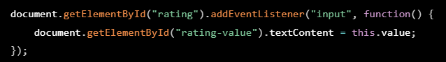
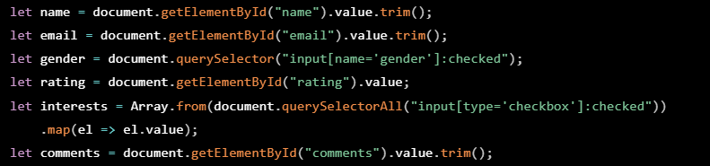
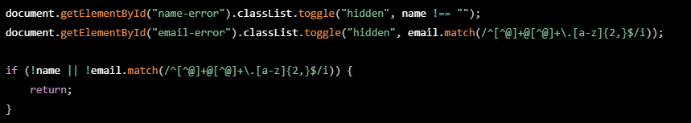
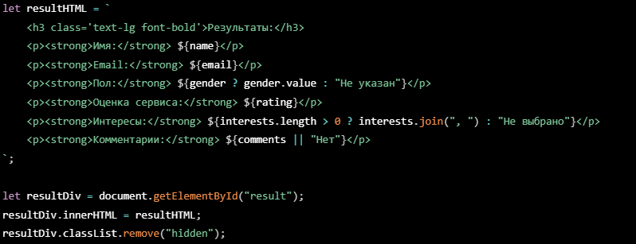

# survey-form
 Форма опроса для сбора данных.Выводит на экран, без отправки на сервер.

Формой опроса для сбора данных о пользователе. 

- В момент ввода часть полей проверяется на правильность заполнения пользователем. После заполнения формы информация о пользователе выводится на экран.

##Поля и функциональности формы:

1) Имя пользователя: текстовое поле, где пользователь должен ввести своё имя.
2) Email: поле для ввода адреса электронной почты. Текстовое поле с валидацией на правильный формат email.
3) Пол: пользователь выбирает свой пол среди двух вариантов: «Мужской» и «Женский» с использованием радиокнопок.
4) Оценка сервиса: ползунок, где пользователь может выставить оценку от 1 до 10.
5) Интересы пользователя: пользователь может выбрать несколько интересов среди опций «Спорт», «Музыка», «Путешествия», «Кино».
6) Дополнительные комментарии: текстовое поле для ввода дополнительных комментариев.
7) Кнопка «Отправить»: при нажатии на кнопку данные пользователя должны валидироваться и (при успешной валидации) отображаться на странице.

##Валидация формы:

1) Имя пользователя и email обязательны для заполнения.
2) Email должен соответствовать стандартному формату email-адреса.
3) Выводятся сообщения об ошибках, если данные введены неправильно.
4) Сбор результирующих данных: после успешной валидации формы отобразите данные пользователя на странице, включая имя, email, пол, оценку сервиса и выбранные интересы.

##Как реализуем код HTML с Tailwind CSS:

- Tailwind CSS https://v2.tailwindcss.com/docs — CSS-фреймворк, который позволяет создавать пользовательские интерфейсы при помощи набора готовых классов. Он был разработан для ускорения процесса разработки и облегчения поддержки кода.

##Как реализуем JavaScript:

📌 1. Обновление значения ползунка (рейтинга)

- Как это работает?
1. Получаем элемент "<input type="range" id="rating">" с помощью  `getElementById("rating")`
2. Добавляем слушатель события `input`, который срабатывает при изменении ползунка.
3. `this.value` получает текущее значение ползунка (от 1 до 10).
4. Мы обновляем текстовое содержимое элемента `5` чтобы показывать текущее значение.

🔹 Что делает код?

Когда пользователь двигает ползунок, число под ним обновляется.

📌 2. Обработка отправки формы

-Как это работает?

1. Находим форму по `id="survey-form"`.
2. Добавляем слушатель события `submit`, который срабатывает при нажатии на кнопку "Отправить".
3. `event.preventDefault();` отменяет стандартное поведение отправки формы (чтобы страница не перезагружалась).

🔹 Что делает код?

Запрещает браузеру перезагружать страницу при нажатии на кнопку "Отправить".

📌 3. Сбор данных из формы

-Как это работает?

1. `document.getElementById("name").value.trim();`
 → Получаем текст из поля имени, убираем пробелы в начале и конце (`trim()`).
2. `document.getElementById("email").value.trim();`
 → Получаем текст из поля email.
3. `document.querySelector("input[name='gender']:checked);`
 → Ищем отмеченный радио-баттон(`checked`).
4. `document.getElementById("rating").value;`
 → Получаем значение ползунка (1-10).
5. `document.querySelectorAll("input[type='checkbox']:checked")`.
 → Ищем все отмеченные чекбоксы.
6. `Array.form(...).map(el => el.value);`
 → Преобразуем список чекбоксов в массив значений(`["Спорт", "Музыка"...]`).
7. `document.getElementById("comments").value.trim();`
 → Получаем текст комментария, убираем пробелы (`trim()`).

🔹 Что делает код?

Собираем все данные, введённые пользователем.

📌 4. Валидация данных

- Как это работает?

1. `document.getElementById("name-error").classList.toggle("hidden", name !== "");`
 → Если поле имя пустое, показываем ошибку.
2. `email.match(/^[^@]+@[^@]+\.[a-z]{2,}$/i)`
 → Проверяем, соответствует ли email правильному формату (содержит `@` и `.`).
3. `if (!name || !email.match(...)) return;`
 → Если имя не заполнено или email невалидный, останавливаем выполнение кода.

 🔹 Что делает код?

Проверяет, ввёл ли пользователь корректные данные. Если нет — не отправляет форму и показывает ошибки.

📌 5. Вывод данных на экран

- Как это работает?

1. Создаём шаблонный HTML-код, в который подставляем данные.
2. `document.getElementById("result").innerHTML = resultHTML;`
 → Вставляем этот код в блок с `id="result"`.
3. `resultDiv.classList.remove("hidden");`
 → Делаем блок видимым (изначально он скрыт `class="hidden"`).

 🔹 Что делает код?

Отображает введённые пользователем данные на странице.

📌 Как работает весь код?

1️⃣ Пользователь вводит данные и двигает ползунок

→ Значение ползунка меняется сразу.

2️⃣ При нажатии "Отправить"

1. JavaScript собирает данные формы.
2. Проверяет имя и email.
3. Если есть ошибки → показывает сообщения.
4. Если всё правильно → выводит данные на экран.

🚀 Итог
🔹 Код позволяет собирать и проверять данные, не перезагружая страницу.

🔹 Ползунок показывает текущую оценку в реальном времени.

🔹 Валидация предотвращает отправку некорректных данных.

🔹 После успешного ввода — результаты появляются на экране.
